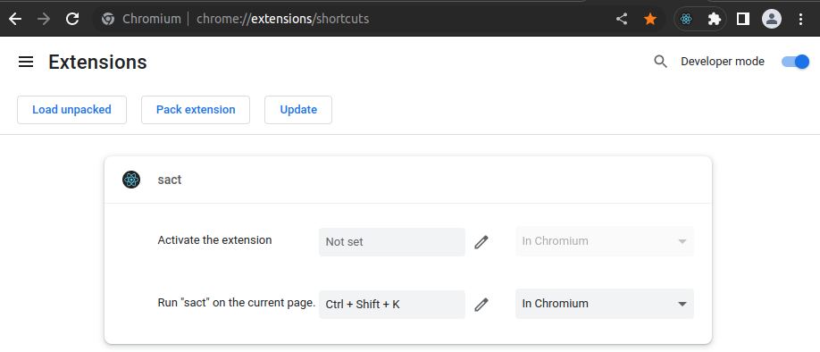

# `sact`

## Search and Act

## Installation

```bash
npm install
```

This will create a new folder `node_modules` with all necessary project dependencies.

## Build

### Production

To create minimized assets for production usage, create the assets using:

```bash
npm run build
```

### Development

Includes source maps

```bash
npm start
```

## Load

After building, the assets will be found in the `dist` folder.

Load the extension from the browser in address `chrome://extensions` > Load unpacked > Select `dist` folder.

Make sure to go to `chrome://extensions/shortcuts` and verify that:

```plaintext
Run "sact" on the current page: Ctrl + Shift + K In Chrome
```


